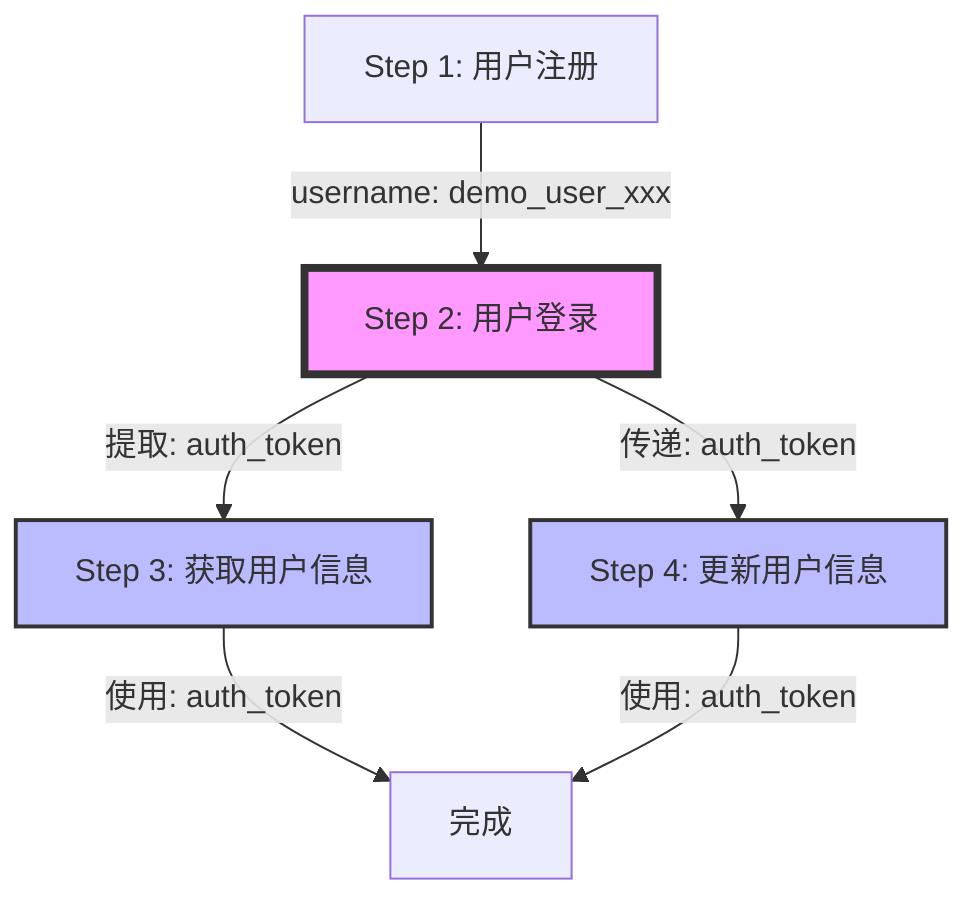

# 变量提取与多接口串联 - 完整演示指南

## 📋 演示场景

**完整用户流程测试**：用户注册 → 登录 → 获取信息 → 更新信息

这个演示展示了如何：
1. 使用环境变量
2. 使用动态变量（SpEL表达式）
3. 在Step间提取和传递变量
4. 串联多个API调用形成完整业务流程

---

## 🎯 已创建的演示数据

| 类型 | 名称 | 说明 |
|------|------|------|
| 项目 | 用户管理系统 | 演示项目 |
| 模块 | 用户认证与管理 | 包含3个测试用例 |
| 环境 | mock | 使用httpbin.org作为Mock API |
| 测试用例 | 用户完整流程测试 | ⭐ 主要演示用例（4步骤） |
| 测试用例 | 健康检查 | 简单的GET请求示例 |
| 测试用例 | 延迟测试 | 测试超时场景 |

---

## 🔍 Step详细配置

### Step 1: 用户注册

**目的**：创建新用户账号

```
Method: POST
URL: ${base_url}/post
Headers: 
{
  "Content-Type": "application/json"
}
Body:
{
  "username": "${test_username}",
  "password": "123456",
  "email": "demo@example.com"
}
Assertion: status_code == 200
```

**变量使用**：
- `${base_url}` - 从环境变量获取，值为 `https://httpbin.org`
- `${test_username}` - 动态生成，使用SpEL: `demo_user_${T(System).currentTimeMillis()}`

---

### Step 2: 用户登录（提取token）⭐

**目的**：用户登录，从响应中提取认证token

```
Method: POST
URL: ${base_url}/post
Headers:
{
  "Content-Type": "application/json"
}
Body:
{
  "username": "${test_username}",
  "password": "123456"
}
```

**🔑 关键配置 - 变量提取器（Extractor）**：

在StepDetail中配置Extractor（未来功能，当前需要通过后端配置）：

```json
{
  "extractorName": "提取认证Token",
  "extractorType": "JSONPATH",
  "expression": "$.json.token",
  "variableName": "auth_token",
  "description": "从登录响应中提取token"
}
```

**httpbin.org响应示例**：
```json
{
  "json": {
    "username": "demo_user_1733307600000",
    "password": "123456",
    "token": "eyJhbGciOiJIUzI1NiIsInR5cCI6IkpXVCJ9..."  ← 提取这个
  },
  "url": "https://httpbin.org/post"
}
```

---

### Step 3: 获取用户信息（使用token）

**目的**：使用Step 2提取的token获取用户信息

```
Method: GET
URL: ${base_url}/get?user=${test_username}
Headers:
{
  "Authorization": "Bearer ${auth_token}"  ← 使用Step 2提取的token
}
```

**变量使用**：
- `${auth_token}` - 从Step 2的响应中提取的值
- 如果token提取成功，请求头会变成：`Authorization: Bearer eyJhbGci...`

---

### Step 4: 更新用户信息

**目的**：使用token更新用户信息

```
Method: PUT
URL: ${base_url}/put
Headers:
{
  "Authorization": "Bearer ${auth_token}",  ← 继续使用token
  "Content-Type": "application/json"
}
Body:
{
  "username": "${test_username}",
  "email": "updated@example.com",
  "phone": "13800138000"
}
```

---

## 🎬 使用步骤

### 1. 查看演示用例

1. 打开浏览器：http://localhost:8888
2. 导航到：**API Testing → Test Cases**
3. 找到并点击编辑：**用户完整流程测试**

### 2. 查看Step配置

左侧会显示4个步骤：
```
├─ Step 1: 用户注册
├─ Step 2: 用户登录（提取token）
├─ Step 3: 获取用户信息（使用token）
└─ Step 4: 更新用户信息
```

点击每个步骤查看详细配置。

### 3. Dry Run（预览变量解析）

1. 点击 **Dry Run** 按钮
2. 选择环境：**mock**
3. 点击 Run

**查看结果**：
- Resolved URL: `https://httpbin.org/post`
- Resolved Body: 可以看到 `${test_username}` 被替换成实际值
- Variables: 显示所有可用变量

### 4. 执行测试

1. 点击 **Run** 按钮
2. 选择环境：**mock**
3. 点击 Execute

**查看结果**：
- 每个Step的执行状态
- Request/Response详情
- 变量提取结果（如果配置了Extractor）

---

## 💡 变量系统详解

### 变量类型

| 类型 | 语法 | 来源 | 示例 |
|------|------|------|------|
| 环境变量 | `${varName}` | Environment配置 | `${base_url}` |
| 动态变量 | `${SpEL表达式}` | Spring Expression Language | `${T(System).currentTimeMillis()}` |
| 提取变量 | `${varName}` | Step执行后提取 | `${auth_token}` |

### 变量优先级

```
提取的变量 > 环境变量 > 项目变量 > 模块变量
```

### 常用SpEL表达式

```java
// 当前时间戳
${T(System).currentTimeMillis()}

// 随机UUID
${T(java.util.UUID).randomUUID().toString()}

// 当前日期
${T(java.time.LocalDate).now()}

// 随机数
${T(Math).random()}
```

---

## 🔧 变量提取配置（当前版本说明）

**⚠️ 注意**：当前Phase 3.1版本中，Extractor配置需要通过后端API设置。

### 通过API配置Extractor

```bash
# 为Step 2添加Token提取器
curl -X POST http://localhost:7777/api/extractors \
  -H "Content-Type: application/json" \
  -d '{
    "extractorName": "提取Token",
    "extractorType": "JSONPATH",
    "expression": "$.json.token",
    "variableName": "auth_token",
    "testStep": {"id": <STEP_ID>}
  }'
```

### 支持的提取器类型

1. **JSONPATH** - 从JSON响应提取
   - `$.data.token` - 提取token
   - `$.data.user.id` - 提取用户ID
   - `$.items[0].name` - 提取数组第一项的name

2. **REGEX** - 正则表达式提取
   - `"token":"([^"]+)"` - 提取token值

3. **HEADER** - 从响应头提取
   - 提取Set-Cookie等

---

## 📊 执行流程图



---

## 🎯 最佳实践

### 1. 变量命名规范
- 使用小写字母和下划线：`auth_token`, `user_id`
- 使用有意义的名称：`access_token` 而非 `token1`
- 环境变量用全大写：`BASE_URL`, `API_KEY`

### 2. 变量提取
- 每个Step只提取必要的变量
- 使用精确的JSONPath表达式
- 添加描述说明变量用途

### 3. 步骤设计
- 每个Step完成一个独立的操作
- 步骤间通过变量传递数据
- 添加清晰的Step Name

### 4. 断言验证
- 每个Step都要添加assertion
- 验证响应状态码
- 验证关键字段存在

---

## 🚀 Phase 3.2 计划中的功能

- ✅ Extractor UI - 在StepDetail中可视化配置提取器
- ✅ Assertion UI - 可视化配置多种断言
- ✅ 变量查看器 - 查看当前所有可用变量
- ✅ 变量高亮 - 在编辑器中高亮显示变量引用
- ✅ 变量自动完成 - 输入`${`时自动提示可用变量

---

## 📞 需要帮助？

如果在使用过程中遇到问题：
1. 检查环境配置是否正确
2. 使用Dry Run预览变量解析
3. 查看控制台日志获取详细错误信息
4. 参考 [API文档](api_endpoints.md)

---

**Happy Testing! 🎉**
